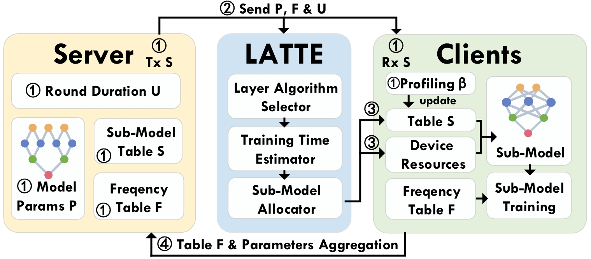

<style>
.markdown-body h1 {
    border-bottom: none
}
.markdown-body h2 {
    border-bottom: 2px solid grey;
}
.markdown-body {
    border-bottom: 2px solid black;
    padding-left: 65px !important;
    padding-right: 65px !important;
    box-shadow: 5px 2px 2px grey;
    background: white;
}
body {
    background: #c1bebe;
}
</style>
<div>
    <br><br><br>
    <h1 style="text-align:center;"><b>LATTE: Layer Algorithm-aware Training Time Estimation for Heterogeneous Federated Learning</b></h1>
</div>


## **Overview**

Accurate estimation of on-device model training time is increasingly required for emerging learning paradigms on mobile edge devices, such as heterogeneous federated learning (HFL). HFL usually customizes the model architecture according to the different capabilities of mobile edge devices to ensure efficient use of local data from all devices for training. However, due to oversimplification of latency modeling, existing methods rely on a single coefficient to represent computational heterogeneity, resulting in sub-optimal HFL efficiency. We find that existing methods ignore the important impact of runtime optimization of deep learning frameworks, which we call development-chain diversity. Specifically, layers of a model may have different algorithm implementations, and deep learning frameworks often have different strategies for selecting the algorithm they believe is the best based on a range of runtime factors, resulting in different training latencies and invalid predictions from existing methods. In this paper, in addition to considering this diversity to ensure synchronized completion time of model training, we also study how to select the best algorithm each time to reduce the latency of the per-round training, thereby further improving the overall efficiency of federated training. To this end, we propose LATTE, which consists of a novel selector that identifies the best algorithm at runtime based on relative runtime factors. By further integrating it into our training latency model, LATTE provides accurate training time estimation. We develop LATTE as middleware, compatible with different deep learning frameworks. Extensive results show significantly improved training convergence speed and model accuracy compared to state-of-the-art methods.


## Overview 



## Publication

 LATTE: Layer Algorithm-aware Training Time Estimation for Heterogeneous Federated

Kun Wang, Zimu Zhou, Zhenjiang Li 

**ACM MobiCom, 2024**

<a href="">[pdf]</a>  <a href="https://github.com/lattecore/LATTE">[code]</a>  <a href="./README.assets/LATTE_slides.pdf">[slides]</a>

## Citation

If you find our work useful in your research, please consider citing:

```
To be anouncement.
```


